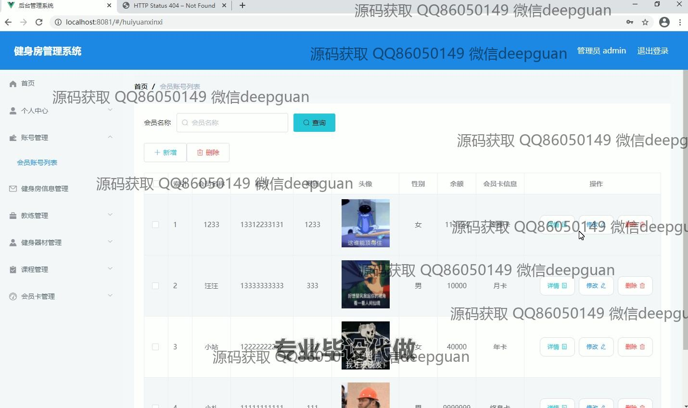
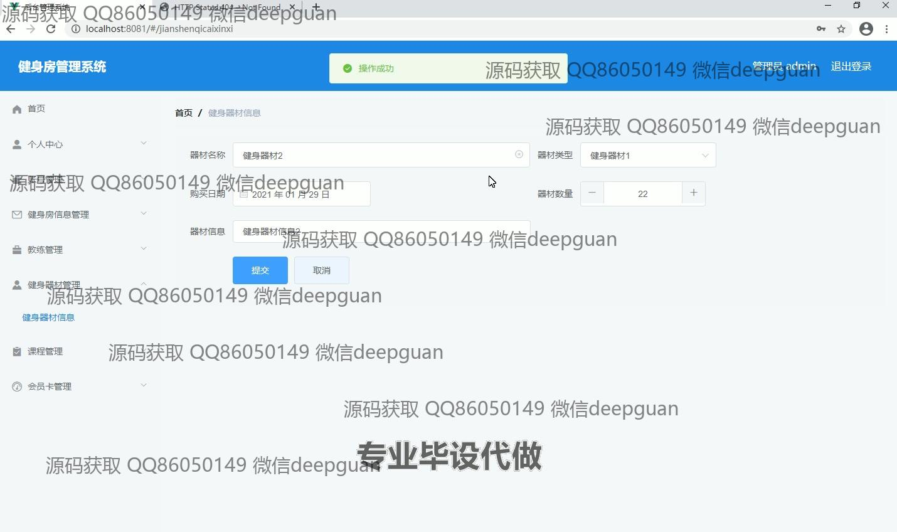
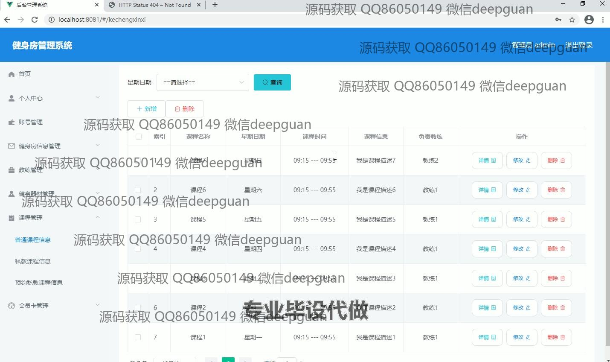

<h1 align="center">基于java的健身房管理系统的设计与实现+vue</h1>

## 简介
健身房管理系统：角色分为管理员、用户；功能包括器材管理、会员管理、课程安排、教练管理、会员卡管理，支持在线预约和登录管理，优化健身房运营效率。    --计算机毕业设计源码；毕设源码；java毕业设计源码

## 联系方式

<h3 align="center">获取完整代码与数据库文件 + 微信：deepguan QQ: 86050149 QQ群: 783742310</h3>

<h3 align="center">可帮忙远程部署 包运行成功！提供远程部署、修改代码、设计文档指导、代码讲解等服务！</h3>

## 功能介绍（完整见运行截图）
管理员：提供个人中心、账户管理、健身房信息管理、教练管理、健身器材管理、课程管理、会员卡管理等功能模块。可以通过系统进行会员管理，包括新增、删除和查询会员；管理健身器材的信息，支持新增、修改和删除；管理课程和教练信息，进行课程安排和教练分配；处理会员卡的新增、修改和删除；通过系统后台管理预约信息，支持查询和批量处理操作。提供密码修改、私教课程安排及健身房区域管理的多项操作。

用户：登录后可以通过个人中心查看和修改个人信息，参与课程预约和私教安排。查阅并管理与自己相关的健身房信息，查看课程和教练安排，并可以参与课程的预约。支持在线查询和申请会员卡，并对健身器材的使用进行反馈。通过系统进行密码修改以保障账户安全，参与对私教课程的预约与评价，在必要时可以通过导航菜单快速切换到相关模块进行操作。

## 运行截图

本代码来源于网络,仅供学习参考使用!

